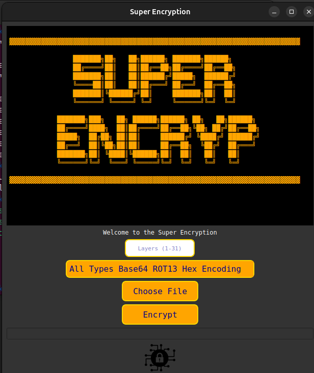

# Super Encryption 

## Overview M
Super Encryption Tool is a Python application built with PyQt5 that allows you to encrypt and decrypt files using multiple layers of encryption. The tool supports various encryption methods such as Base64, ROT13, and Hex encoding.

## Features
- Multiple layers of encryption (up to 31 layers).
- Supports different encryption types: Base64, ROT13, Hex encoding, and a combination of all types.
- User-friendly interface with real-time progress updates.
- Generates decryption code for various programming languages (Python, Bash, JavaScript, PowerShell, Ruby, C++).

## Supported File Types
The tool supports encryption for the following file types:

| File Type          | File Extension  |
|--------------------|-----------------|
| All Files          |    `*.*`        |
| Python Files       |    `*.py`       |
| JavaScript Files   |    `*.js`       |
| Ruby Files         |    `*.rb`       |
| C++ Files          |   `*.cpp`       |
| PowerShell Files   |   `*.ps1`       |
| Bash Files         |   `*.sh`        |

## Requirements
- Python 3.x
- PyQt5
- cryptography

## Installation
1. Clone the repository:
    ```sh
    git clone https://github.com/chra12/super-encryption-tool.git
    cd super-encryption-tool
    ```
2. Install the required dependencies:
    ```sh
    pip install -r requirements.txt
    ```

## Usage
1. Run the application:
    ```sh
    python3 main.py
    ```
2. Use the graphical interface to select a file, choose the number of encryption layers, and select the encryption type.
3. Click the "Encrypt" button to start the encryption process.
4. The encrypted file will be saved with the suffix `_encrypted` in the same directory as the original file.
5. The application will also generate a decryption script in the same directory as the encrypted file.

## Encryption Types
- **Base64**: Encodes the file content using Base64 encoding.
- **ROT13**: Encodes the file content using ROT13 encoding.
- **Hex Encoding**: Encodes the file content using Hex encoding.
- **All Types**: Applies a combination of Base64, ROT13, and Hex encoding in a cyclic manner.

## Decryption Scripts
The tool generates decryption scripts for the following programming languages:
- Python
- Bash
- JavaScript
- PowerShell
- Ruby
- C++

The decryption script will be saved in the same directory as the encrypted file and will contain the necessary code to decrypt the file.

## Contributing
Contributions are welcome! Please open an issue or submit a pull request.

## License
This project is licensed under the MIT License. See the [LICENSE](LICENSE) file for more details.



# Super-Encryption
# Super-Encryption
